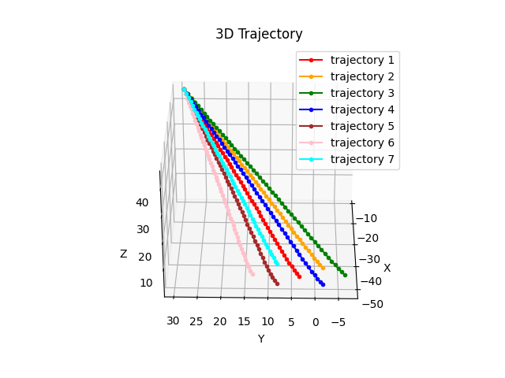

# software for the paper 
# "Generating and Customizing Robotic Arm Trajectories using Neural Networks"

generation of trajectories (for the legibility experiment):

<pre>
python generate.py 1
python generate.py 2
python generate.py 3
python generate.py 4
python generate.py 5
python generate.py 6
python generate.py 7
</pre>

or 

<pre>
generate.bat
</pre>

the generated trajectories are: generated1.txt, ..., generated7.txt

evaluation and visualization:

<pre>
python evaluation.py
</pre>

replay:

<pre>
cd ..\replay
python replay.py
</pre>

See also [comparison to the classic IK](https://github.com/andylucny/nico2/tree/main/generate-ikpy) -

See also [other project based on this novel method](https://github.com/andylucny/nico2/tree/main/generate-letters) -

